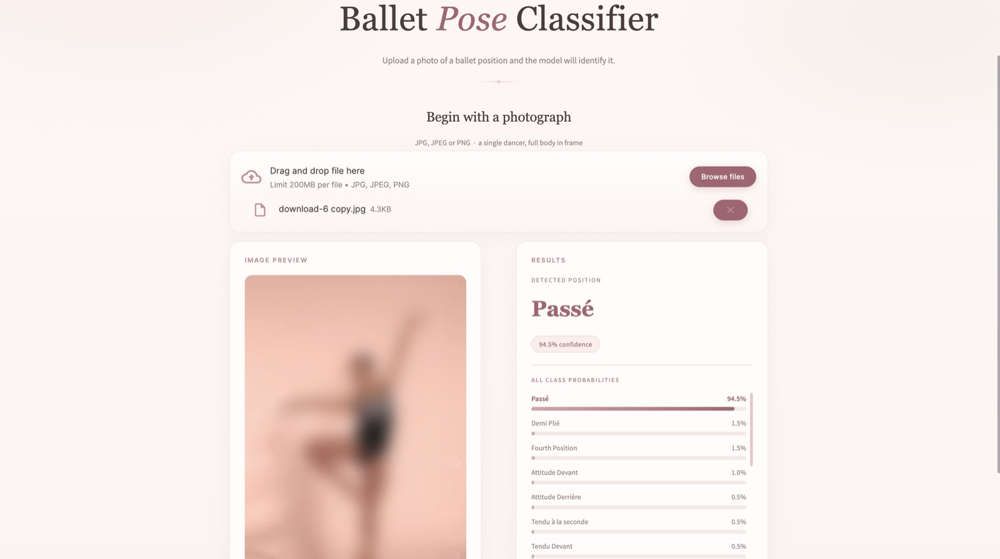
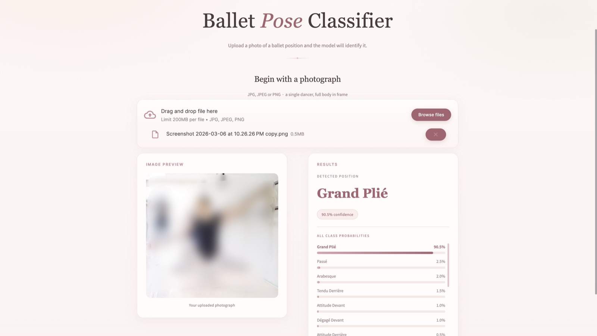
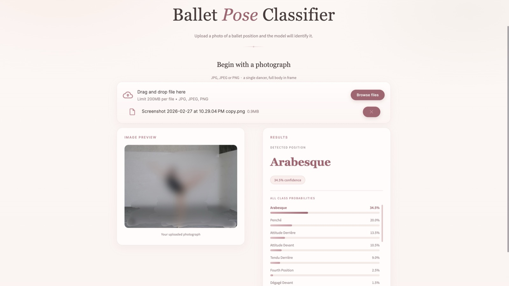

# 🩰 Ballet Pose Classifier

A machine learning pipeline that identifies ballet positions from a single photograph, using pose estimation and joint angle features. Upload an image in the Streamlit demo and the model returns the predicted position along with a confidence score for every class.

```
Image → MediaPipe Pose → 33 3D Keypoints → Joint Angle Features → ML Classifier → Ballet Position Label
```

Instead of training on raw pixels, the model trains on **joint angles** derived from skeletal keypoints. This makes the classifier:

- **Rotation-invariant** — works from multiple camera angles
- **Scale-invariant** — works regardless of the dancer's distance from the camera
- **Side-invariant** — a left arabesque and a right arabesque are treated as the same pose

## Demo

The web demo accepts a JPG or PNG of a single dancer and returns the predicted position with a full probability breakdown.

**Passé — a clean, high-confidence prediction (94.5%)**



**Grand plié — a two-legged position recognised from a busy studio photo (90.5%)**



**Arabesque — a lower-confidence case where related positions compete (34.5% arabesque vs. 20% penché)**



The third example is the honest one: arabesque, penché and attitude derrière differ mainly in the angle of the working leg and the tilt of the torso, so the probability list is where the model's uncertainty shows.

> The photographs in these screenshots are blurred. They were reference images used during development, are not owned by this project, and are not distributed with it.

## Features

- **Single-image inference** — no video or multi-frame input needed
- **Pose-based features** — 24 joint angles rather than raw pixels, so the model trains well on a small dataset
- **Side-invariant classification** — mirrored versions of a pose collapse into one class
- **Feature-group-aware model** — a `GroupedClassifier` routes each pose family to a sub-model that only sees the joint angles relevant to it
- **Four baseline classifiers** — Random Forest, SVM, Gradient Boosting and an MLP, trained and compared in a single run
- **MLflow experiment tracking** — every run's parameters and metrics are logged, and the best model is saved automatically
- **Streamlit web demo** — upload a photo, see the prediction and the full probability distribution

## Tech Stack

| Component | Library |
|---|---|
| Pose estimation | MediaPipe Tasks (`pose_landmarker_heavy`) |
| Image I/O | OpenCV |
| Classifiers | scikit-learn (Random Forest, SVM, Gradient Boosting, MLP) |
| Data handling | NumPy, pandas |
| Experiment tracking | MLflow |
| Web demo | Streamlit |
| Configuration | PyYAML |

## Supported Positions

The model recognises 19 positions, defined in [`data_config.yaml`](data_config.yaml):

| Category | Classes |
|---|---|
| Positions | `first_position`, `second_position`, `third_position`, `fourth_position`, `fifth_position` |
| One-legged | `arabesque`, `attitude_derriere`, `attitude_devant`, `passe`, `penche` |
| Tendu | `tendu_devant`, `tendu_a_la_seconde`, `tendu_derriere` |
| Dégagé | `degage_devant`, `degage_a_la_seconde`, `degage_derriere` |
| Two-legged | `demi_plie`, `grand_plie`, `fondu` |

To add a position, add its name to `data_config.yaml`, list it under the appropriate group in [`src/utils/feature_groups.py`](src/utils/feature_groups.py), create `data/raw_images/<class_name>/`, then rebuild and retrain. Classes with no image folder are skipped with a warning.

## Getting Started

### Prerequisites

- Python 3.9–3.12 (developed on 3.12; MediaPipe does not yet support 3.13)
- macOS, Linux or Windows

### 1. Install dependencies

```bash
git clone https://github.com/viviankahm07/BalletClassifier.git
cd BalletClassifier

python3 -m venv .venv
source .venv/bin/activate        # Windows: .venv\Scripts\activate

pip install -r requirements.txt
```

The MediaPipe pose landmarker model (~25 MB) is **downloaded automatically** the first time you run any command that extracts a pose. No API keys, credentials or environment variables are required.

### 2. Run the demo

```bash
streamlit run app.py
```

Opens at <http://localhost:8501>. A trained Random Forest model ships with the repository, so the demo works immediately after install — no training required. Upload a photo and the predicted position appears alongside the full probability breakdown.

### 3. Predict from the command line

```bash
python3 predict.py --image path/to/image.jpg
```

Prints the predicted position, its confidence and an ASCII bar chart of all class probabilities.

## Training Your Own Model

The included model was trained on a private image set that is not distributed with this repository. To train your own:

### 1. Add training images

Create one folder per class under `data/raw_images/` and drop images in:

```
data/raw_images/
├── arabesque/
├── first_position/
├── passe/
└── ...
```

Aim for 100+ JPG or PNG images per class. `data/` is gitignored, so your images stay local.

### 2. Build the dataset

```bash
python3 build_dataset.py
```

Runs pose extraction on every image, converts each detected skeleton to joint angles, and writes `train.csv`, `val.csv`, `test.csv` and `label_classes.npy` into `data/splits/`. Images where no pose is detected — or where landmark confidence is too low — are reported and skipped.

### 3. Train

```bash
python3 run_training.py
```

Trains every model, prints a per-class classification report, logs each run to MLflow and saves the best performer to `models/saved/best_model_<name>.pkl`. The demo loads the most recently modified `.pkl` in that folder, so your newly trained model is picked up automatically.

Browse the tracked experiments:

```bash
mlflow ui
```

## Usage Notes

For the most reliable predictions, upload photos where:

- a **single dancer** is in frame — MediaPipe uses the first person it detects
- the **full body** is visible, including feet
- the pose is a clear, held position rather than a mid-transition blur

If no skeleton can be detected, the app says so rather than guessing.

## Configuration

[`data_config.yaml`](data_config.yaml) holds the class list, train/val/test ratios, random seed, valid image extensions and the minimum images per class. Model hyperparameters live in the classifier wrappers in [`src/models/classifier.py`](src/models/classifier.py) — edit them there to change training behaviour.

Both `build_dataset.py` and `run_training.py` also accept CLI overrides, e.g.:

```bash
python3 build_dataset.py --images data/raw_images --splits data/splits
python3 run_training.py --splits data/splits --models models/saved
```

## Feature Design

The model uses **24 joint angle features** per image:

- **12 directional angles** — left/right knee, hip, elbow, shoulder, ankle and hip abduction (turnout)
- **4 symmetric arm angles** — sorted left/right pairs, so an arm raised on either side looks identical (used for third and fourth position)
- **8 symmetric leg angles** — sorted left/right pairs, so either working leg looks identical (used for all one-legged poses)

Keypoints are first centred on the hip midpoint and scaled by torso length, which removes the dancer's position and size in frame before any angle is computed.

The `GroupedClassifier` then trains a separate sub-model per feature group, so each pose family only sees the angles that distinguish it:

| Group | Features used | Classes |
|---|---|---|
| `leg_focused` | 8 symmetric leg angles | tendu, dégagé, arabesque, attitude, passé, penché, pliés, fondu |
| `symmetric_body` | 8 symmetric leg + 4 symmetric arm angles | third, fourth position |
| `full_body` | all 12 directional angles | first, second, fifth position |

## Data Collection Tips

- Screenshot clear, held positions from ballet tutorials or class footage
- Aim for 100+ images per class
- Capture a mix of front, side and diagonal views
- For side-invariant poses (arabesque, tendu, attitude) images from either side both count toward the same class

## Project Structure

```
BalletClassifier/
├── src/
│   ├── extraction/
│   │   └── pose_extractor.py      # MediaPipe keypoint extraction
│   ├── preprocessing/
│   │   ├── normalizer.py          # Keypoints → joint angle features
│   │   └── dataset_builder.py     # Build train/val/test splits
│   ├── models/
│   │   ├── classifier.py          # RF, SVM, Gradient Boosting, MLP wrappers
│   │   └── grouped_classifier.py  # Feature-group-aware classifier
│   └── utils/
│       ├── config.py              # Load YAML configs
│       └── feature_groups.py      # Which features each pose group uses
├── data/                          # Training images and splits (gitignored)
├── models/saved/                  # Trained model — only the best .pkl is committed
├── docs/images/                   # Demo screenshots
├── app.py                         # Streamlit web demo
├── build_dataset.py               # Pose extraction + split building
├── run_training.py                # Train all models, log to MLflow
├── train.py                       # Training loop
├── predict.py                     # Single-image CLI inference
├── data_config.yaml               # Class names, split ratios, image settings
└── requirements.txt
```
